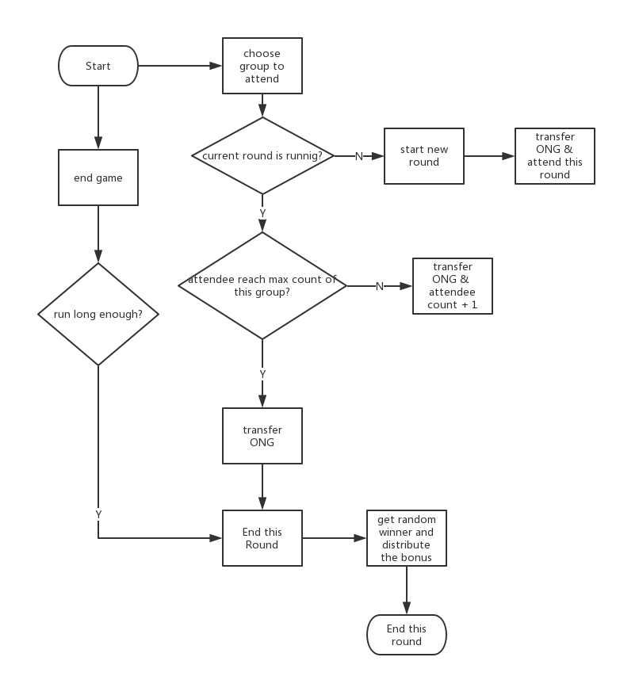

<h1 align="center">Wontology</h1>

  <b>Win ONG</b>

# Overview

This project aims to develop a decentralized game named Wontology based on ontology smart contract. The idea of Wontology game comes from "lottery". The difference is that all the assets in Wontology will go back to the participants except for the transaction fee. Our team [ONT-Avocados](https://github.com/ONT-Avocados) will not take anything. You can participate the game by sending ONG to the contract address through the interface we provide and grab the chance to win all ONG of the current round. You can try your luck in both TestNet and MainNet. The source code is public and test results are provided.

The following contents include:
- [Overview](#overview)
  - [Instruction](#instruction)
  - [Design](#design)
    - [Wontology Description](#wontology-description)
    - [Wontology Logic Flow](#wontology-logic-flow)
  - [Source code](#source-code)
  - [Test resources](#test-resources)
  - [How to play](#how-to-play)
    - [preparation](#preparation)
    - [Play](#play)
- [Contributing](#contributing)
- [Contact](#contact)
- [License](#license)

## Instruction
Inspired by "lottery", we designed "Wontology". You can participate the game using your ONG.

Wontology game is based on Ontology block chain, providing an open lottery game for every one.

Ontology block chain has 2 tokens : ONT and ONG , ONT cannot be divided , so our game will use ONG for entertainment.

## Design

### Wontology Description

* The Wontology game can be classified into four different types according to the size of ticket pool, which is k = 2, 5, 10, or 20. 
  
* Everytime a player wants to play the game, he will need to choose a specific ticket pool k.
  
* Everytime a player plays the game, he will be asked to transfer 1 ONG to the smart contract address. Once the transaction is confirmed, he will be assigned a ticket number i (1 <= i <= k).
  
* The round of each kind of ticket pool will grow automatically based on the participation activity. Say, if the n-th round of 5-ticket-pool have 5 players already, then the new player who places 1 ONG wager will be assigned into the (n+1)-th round of 5-ticket-pool. There is no limit of round number.
  
* The first player in the n-th round of k-pool will be responsible to start a new round of game.
  
* Once the number of participants in the n-th round of k-pool has reached k, the last player will be responsible to end this round game. Or when the number of participants in the n-th round of k-pool has not reached k yet the current round has lasted MaxTime = 3 min * k, the current round can be ended by anyone who invokes "endGame" method.
  
* When the n-th round of k-pool ends, Wontology contract will generate a random integer K between 1 and k, the lucky participant with ticket number K will be the winner to receive all the ONG in the current pool.
  
* Since the first player in the n-th round of k-pool will activate "startNewRound" and the k-th (last) player in the n-th round of k-pool may activate "endGame", which means he or she will spend extra fee, Wontology contract will transfer this part of extra fee to the first player and the k-th player(if he exists) when the n-th round of k-pool ends.

### Wontology Logic Flow

Wontology game has 4 pools: 2,  5 , 10, or 20 tickets for each round in one pool, every wager costs 1 ONG (exclude the network costs).

Any player can try to end a round game if there is not enough players and the duration of this round game has lasted too long.

Wontology Game flow looks like the following:

<!--  -->

  

## Source code
The Wontology smart contract can be found publicly in  contract folder.

## Test resources
Based on python-test-framework for ontology smart contract, test resources are given  test resources  folder.

## How to play

With preparation, you can play Wontology in both [TestNet](http://47.52.72.227:9001/#/) and MainNet.

### preparation

1. Install ontology chrome plugin wallet - [Cyano wallet](https://chrome.google.com/webstore/detail/cyano-wallet/dkdedlpgdmmkkfjabffeganieamfklkm).

2. Make sure you have some ONG balance in your wallet.

### Play

1. Go to the game in [TestNet](http://47.52.72.227:9001/#/) or MainNet Website.

2. Select the type of game you'd like to participate.

3. Click, join, and send the ONG.

4. Wait for the game to end, then check the winner and your ONG balance.

# Contributing

Feel free to contribute to this project.

# Contact

- [@ONT-Avocados](https://github.com/ONT-Avocados) on Github
- Send me an email tonyclarking@gmail.com

# License

- Open-source [MIT](https://github.com/ONT-Avocados/Wontology/blob/master/LICENSE)
